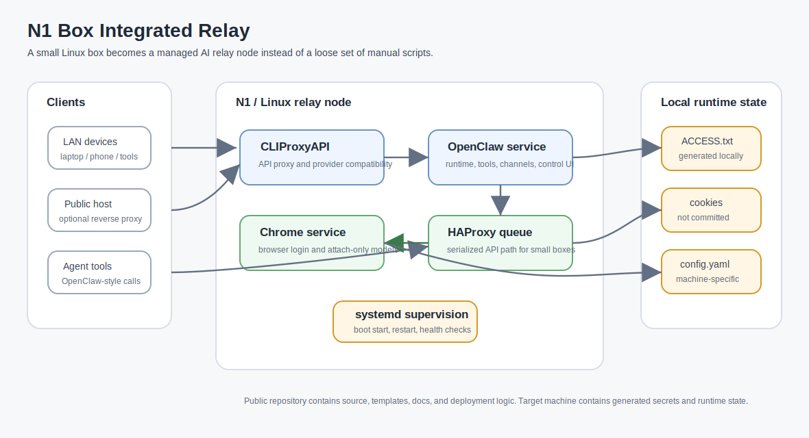
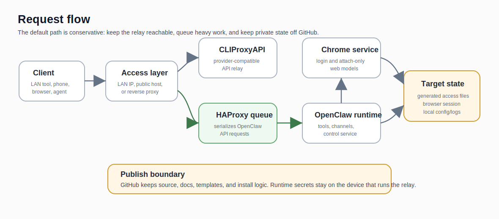

# N1 Box Integrated Relay Package

This repository started from a practical problem: I wanted a small Linux box to behave like an always-on AI relay node, not like a fragile folder of scripts that only works on the machine where it was first assembled.

The project brings together two upstream codebases, `CLIProxyAPI` and `openclaw-zero-token`, and adds the deployment layer that is usually missing when people try to run this kind of stack on an N1 box, ARM Linux box, mini PC, or small VPS.



The important part of this repository is not just that those upstream trees are present. The important part is the working shape around them:

- service files for long-running operation;
- HAProxy queueing for small devices that should not handle unlimited concurrent requests;
- Chrome/Chromium service management for browser-based model login and attach-only web workflows;
- install-time configuration for LAN and public access;
- a safer publish layout that keeps real cookies, access files, browser state, and local runtime data out of Git;
- notes and scripts that document how this setup is expected to run after reboot.

In short, this is an attempt to turn a one-off N1 setup into something other people can inspect, adapt, and reproduce.

## What problem it solves

Running AI relay tooling on a normal desktop is one thing. Running it on a small always-on box is different.

A small device needs boring, conservative engineering:

- services should restart after boot;
- request bursts should be serialized or queued;
- browser login state must be handled carefully;
- LAN access should work without editing many files by hand;
- public access should be possible without mixing public examples with private secrets;
- generated files should stay on the target machine instead of being committed back to the repository.

Most failures I ran into were not caused by one single upstream project. They came from the gaps between projects: one process not starting after reboot, one port not matching the docs, a browser session not being available, a small box getting overloaded, or a private runtime file accidentally ending up next to publishable source.

This repository is mainly about closing those gaps.

## What is inside

```text
n1-box/
├── CLIProxyAPI/              # API proxy/provider compatibility source tree
├── openclaw-zero-token/      # OpenClaw runtime, tools, channels, and browser-related source tree
├── config/                   # publishable example configs
├── haproxy/                  # serialized API queue config
├── systemd/                  # service definitions
├── scripts/                  # non-destructive checks and maintainer helpers
├── docs/                     # install, security, design, and deployment notes
├── install_n1.sh             # Linux/N1 install entry point
├── .gitignore
├── LICENSE
└── README.md
```

The repo should be read as:

```text
upstream source trees + small-device deployment layer + service orchestration + queueing + safety boundary
```

That last part matters. Without the deployment layer, this would mostly be a source mirror. Without the upstream projects, the deployment layer would not do anything useful. The value is in making the combined system understandable and repeatable.

## Quick checks before installing

The repository includes two non-destructive checks that are safe to run before installing anything.

```bash
bash scripts/doctor.sh
```

`doctor.sh` checks the local machine and repository layout. It looks for required project files, optional build artifacts, useful host commands, common relay ports, and existing systemd service names. It does not install packages, start services, or write system files.

```bash
bash scripts/check-repo-health.sh
bash scripts/check-publish-safety.sh
```

These checks are also wired into GitHub Actions. They help keep the public repository useful and safe by checking shell syntax, local docs links, expected files, large tracked files, private machine identifiers, and obvious secret-shaped mistakes.

## Target behavior

The intended deployed system looks like this:

- `CLIProxyAPI` runs as a managed service;
- `openclaw-zero-token` runs as a managed service;
- a Chrome/Chromium debug browser can stay available for attach-only web model workflows;
- HAProxy exposes a serialized OpenClaw API port so small machines are not flooded by parallel requests;
- the box can be reached from LAN devices, and optionally through a public host or reverse proxy;
- local access information is generated on the target machine;
- services come back after reboot.



The default design favors reliability over maximum throughput. That is intentional. An N1-style box is more useful as a stable relay than as a machine that accepts too much work and then becomes unreliable.

## Deployment styles

### LAN box

For a home or lab network, the device can be reached through a LAN address such as:

```text
192.168.1.100
```

### Public server

The same layout can be adapted to a public Linux server. For public access, a reverse proxy and HTTPS should be used for the UI side. The noVNC/browser login service should not be exposed directly to the public internet unless the operator understands the risk.

Example install variables:

```bash
sudo N1_LAN_IP=192.168.1.100 \
  PUBLIC_ACCESS_HOST=203.0.113.10 \
  PRIMARY_ACCESS_HOST=203.0.113.10 \
  CONTROL_UI_EXTRA_ORIGINS=https://openclaw.example.com \
  ./install_n1.sh
```

## Source-first public release

This public repository is kept source-first on purpose.

It should not contain real local runtime state, browser cookies, generated access files, account logs, or private machine configuration. Those files belong on the machine that is actually running the services.

For a completely offline one-shot install, generated artifacts such as prebuilt binaries or compiled runtime/frontend outputs should be produced through one of these paths:

- build them from source during install;
- publish them as GitHub Release artifacts;
- keep a private machine-specific deployment bundle outside the public source repository.

The current public branch is the integration source and documentation base. The next step is to make the build/release artifact path cleaner so a fresh clone can be turned into a ready-to-run bundle with fewer manual steps.

## What the installer is meant to handle

The installer is designed around the deployment shape, not around a single binary:

- verify the expected layout before changing the target machine;
- install runtime packages;
- detect or install a usable Chrome/Chromium package;
- install Node.js 22 and pnpm when needed;
- copy project files into `/opt`;
- install OpenClaw runtime dependencies;
- install service files;
- install HAProxy queue config;
- generate local API keys and access information when not provided;
- enable services at boot;
- start services and stop early with logs if a health check fails.

Typical local output files after install:

- `/opt/cli-proxy-api/ACCESS.txt`
- `/opt/openclaw-zero-token/ACCESS.txt`

Typical ports:

- `8317` -> CLIProxyAPI
- `3001` -> OpenClaw control UI
- `3002` -> serialized OpenClaw API
- `9222` -> local Chrome CDP for attach-only web models
- `6080` -> noVNC auth browser

## Security boundary

These should not be committed:

- `.openclaw-upstream-state/`
- `auth-profiles.json`
- real `ACCESS.txt`
- real `config.yaml`
- cookies
- bearer tokens
- account logs
- local browser profiles
- machine-specific runtime directories

The repository should contain source, examples, templates, and deployment logic. Real secrets and runtime state should be generated or stored on the target machine.

## Project direction

This is an early public release, but the direction is clear:

- make the install path more reproducible on fresh Linux/N1 machines;
- separate source, generated artifacts, and private runtime state more cleanly;
- add a release-bundle path for users who do not want to build everything manually;
- record tested device/server reports;
- document failure cases such as browser login problems, queue behavior, proxy access, and service startup failures;
- keep upstream synchronization understandable instead of hiding changes in a private bundle.

## Why it is not just an integration dump

A simple integration dump would only place two upstream projects in one folder.

This repository tries to define how the combined stack should behave on a real small machine:

- what should be a system service;
- which port should be exposed directly;
- which port should be serialized;
- which files are safe to publish;
- which files must stay local;
- how browser login should be separated from the API relay path;
- how the same setup can be moved from an N1 box to a small public server.

That is the part I want to keep improving.

## Docs

- [Why this project matters](./docs/why-this-project.md)
- [Design decisions](./docs/design-decisions.md)
- [Install on Linux or N1](./docs/install-n1.md)
- [Quick start](./docs/quick-start.md)
- [Public server deployment](./docs/public-server.md)
- [Publish to GitHub](./docs/publish-github.md)
- [Security and secrets](./docs/security-and-secrets.md)
- [Changelog](./CHANGELOG.md)

## Short description

A Linux/N1 deployment project for running self-hosted AI relay nodes on low-cost always-on machines. It combines CLIProxyAPI, OpenClaw Zero Token, systemd services, HAProxy queueing, browser-based model login, safety checks, and safe publish rules into one reproducible layout.
